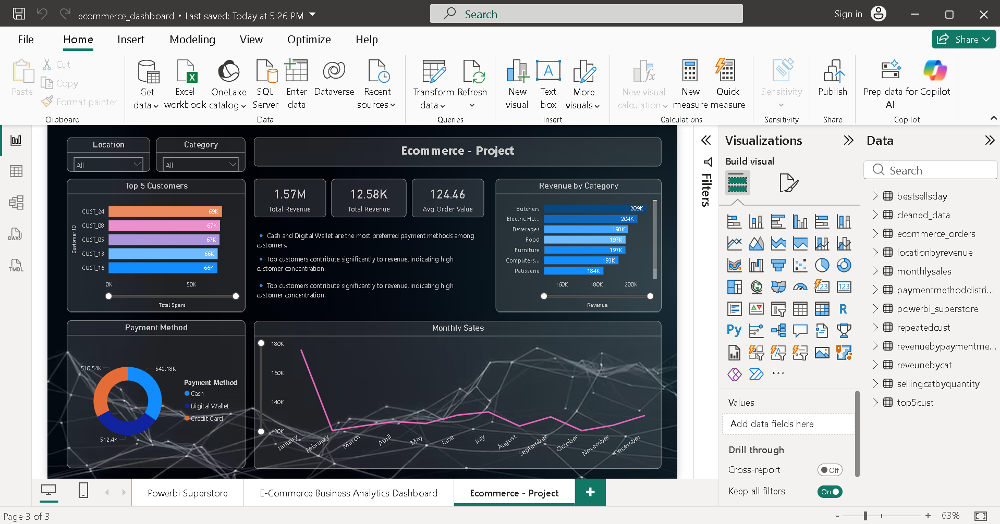

## 📊 E-Commerce Sales Dashboard (Power BI Project)
🔍 Overview

This project is an interactive E-Commerce Sales Dashboard built using Power BI to analyze business performance and generate actionable insights. It helps in understanding customer behavior, sales trends, and revenue distribution across different categories.

## 📁 Dataset

The dataset includes raw and cleaned data related to:

Customer transactions
Product categories
Payment methods
Sales over time
Data preprocessing was performed using Python (Pandas) before visualization.

## ⚙️ Tools & Technologies

Power BI – Dashboard creation & data visualization <br>
Python – Data cleaning and preprocessing <br>
SQL – Data analysis queries <br>
Excel/CSV – Data storage <br>
📌 Key Features <br>
📈 Total Revenue, Orders & Average Order Value overview <br>
🏆 Top Customers Analysis <br>
💳 Payment Method Distribution (Cash, Card, Wallet) <br>
📊 Revenue by Category visualization <br>
📅 Monthly Sales Trend Analysis <br>
🎛️ Interactive filters for better insights <br>
💡 Insights Generated <br>
Digital payments are widely preferred over cash
A small group of customers contributes significantly to revenue
Certain product categories dominate overall sales
Sales trends fluctuate monthly, highlighting seasonal patterns


## 📂 Project Structure
```
ecommerce-project/
│── data/
│   ├── raw_data.csv
│   ├── cleaned_data.csv
│
│── powerbi/
│   ├── ecommerce_dashboard.pbix
│
│── python/
│   ├── cleaning.ipynb
│
│── sql/
│   ├── analysis.sql
```


## 🚀 How to Use
Download the .pbix file
Open in Power BI Desktop
Explore dashboard using filters and visuals


## 📷 Dashboard Preview




## 🙌 Conclusion
This project demonstrates my ability to:

Clean and transform raw data <br>
Build interactive dashboards <br>
Extract meaningful business insights <br>
